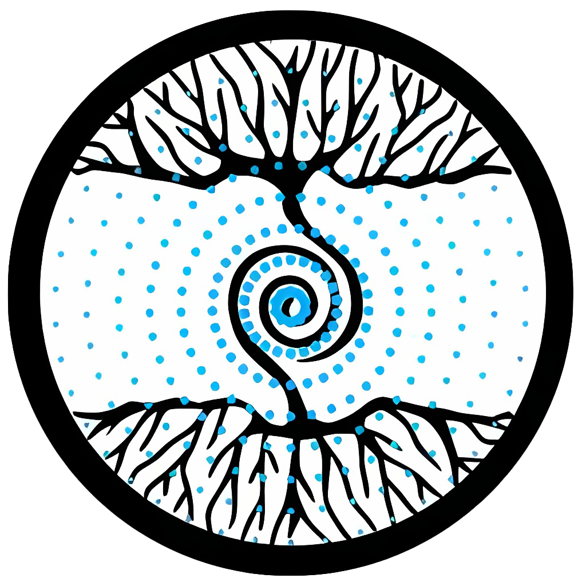

# CodeGen: SLM (Small Language Model) Driven Coding

<div align="center">
    
</div>

<h2>What is CodeGen?</h2>
<p>Enhancing the replitv3 3B language model's code generation by ongoing diverse language training,
  employing fine-tuning for accurate pattern prediction in coding paradigms.</p>

<ul>
  <li>Tools: FastAPI, Docker (with watchtower enabled), GitHub Actions, React JS, HTML, CSS, Vanilla JS,Redis.</li>
  <li>Technologies: OAuth, JWT, Google Sign-In</li>
  <li>Machine Learning Models: Replitv3 3B (3B parameter Causal Language Model focused on CodeInstruction, employing ggml quantization for faster inference)</li>
</ul>
<br>


## Key Features 🎯

- :white_check_mark: **Fast & Efficient**: Models are qunatized using ggml to 4bit to provide faster inference on edge device
- :white_check_mark: **Secure**: Made with security in mind, Your data your control.
- :white_check_mark: **Docker Support**: Comes with docker support, which makes it cross-platform and can be run on any os
- :white_check_mark: **Offline Mode**: Works in offline Mode, so that your data is with you only. 
- :white_check_mark: **Redis Chat history**: Comes with chat history support so that you can navigate to your queries. [Collaboration with <a href="https://github.com/HetaVyas">Heta Vyas</a>]

## Future ideas & implementation
- :white_check_mark: **Content Moderation**: Controlling the behaviour of model to not provide harmful asnwers & query, and also it should only provide code.
- :white_check_mark: **Authentication & Security** [Collaboration with <a href="https://github.com/HetaVyas">Heta Vyas</a>]
- :white_check_mark: **Cloud Storage of Chat history**: Provide a cloud storage for authenticated users. [Collaboration with <a href="https://github.com/HetaVyas">Heta Vyas</a>]

## Demo Highlights 🎥


## Setup

# Step one with python locally

First create a venv.

```sh
python -m venv env && source env/bin/activate
```

Next update the ctransformer submodule
```sh
git submodule update --init 
```

Next install the requirements
```sh
pip install -r requirements.txt
```

Next download the model weight 

```sh
python download_model.py
```

Now run the server.py

```sh
uvicorn server:app --reload
```

# Run using Docker

